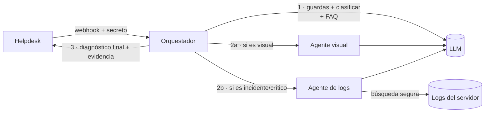

# AI Ticket Triage Agents

[](https://github.com/santiagovalenzuelalopez-gif/ai-ticket-triage-agents/actions/workflows/ci.yml)


Sistema de **triaje automático de tickets** para una mesa de servicio. Cuando entra un ticket nuevo, un **orquestador** lo clasifica con apoyo de una base de FAQ (RAG), convoca a **agentes especialistas** según el caso y publica en el ticket un único diagnóstico inicial con la evidencia que lo respalda:

- **Agente visual**: analiza las capturas y diseños adjuntos.
- **Agente de logs**: busca errores fatales de la entidad afectada en los logs del servidor y los diagnostica.

Todo corre **sin credenciales** (helpdesk, LLM y logs simulados) y, con la misma base de código, se despliega como **un solo proceso o como tres servicios**.



## Lo difícil de un sistema así (y cómo se resolvió)

| Problema | Decisión |
|---|---|
| **El texto del ticket lo escribe un tercero** y de él sale la "entidad" que se busca en un servidor | El valor se reduce a un token estricto (`[a-z0-9-]`), se entrecomilla con `shlex.quote` y, si no cumple, **no se busca**: dos capas, porque una falla de cualquiera sería ejecución remota de comandos. Tests con `"; rm -rf /`, `$(...)`, backticks, `*`, `../` |
| Conexión SSH a un servidor de producción | Solo hosts ya registrados (`RejectPolicy` + `known_hosts` obligatorio); `AutoAddPolicy` aceptaría la clave de cualquiera, incluido un intermediario |
| **Prompt injection** desde el ticket | El texto va delimitado como dato; el modelo no elige herramientas ni ejecuta nada: su salida solo se publica como texto o se valida contra listas cerradas (p. ej. un `type_id` inventado nunca se envía) |
| Los webhooks se reintentan y duplican | Idempotencia por **marca en el ticket** (nota propia) + bloqueo de procesamiento en curso; dos eventos simultáneos procesan el ticket **una vez** |
| Un especialista lento o caído | Corren **en paralelo**, cada uno con presupuesto de tiempo; si fallan o tardan, el diagnóstico sale igual y lo indica ("omitido por latencia"); solo cuentan como insumo los que aportaron |
| No pisar trabajo humano | Solo tickets en estado nuevo y con ≤ 2 artículos; con una conversación en marcha no se interviene |
| Un diagnóstico erróneo del tipo de ticket | *Kill switch* (`TICKET_TYPE_ENABLED`): el tipo se calcula y se escribe en el texto, pero no se modifica el ticket |
| Evidencia confiable | Las líneas de log y los hallazgos visuales se anexan **literales, después** del texto del modelo; no son paráfrasis |
| Ventana de tiempo de los logs | La búsqueda filtra por la fecha del *archivo*, que también devuelve errores viejos: se vuelve a filtrar por el timestamp de **cada línea**, en la zona horaria del servidor de logs |
| Muchos errores | Más de `CONSOLIDATE_ABOVE` → un diagnóstico consolidado (una llamada al LLM, no cientos) |

Más contexto y decisiones en [docs/ARQUITECTURA.md](docs/ARQUITECTURA.md).

## Un código, tres desplegables

`SERVICE_ROLE` decide qué se monta. El orquestador no sabe si los especialistas son módulos o servicios: usa el mismo contrato en proceso (`InProcess*Client`) o por HTTP (`Http*Client`, con identidad de servicio).

| Rol | Expone | Para qué |
|---|---|---|
| `all` | webhook + especialistas | demo y desarrollo (un proceso) |
| `orchestrator` | webhook | llama a `VISION_URL` / `LOGS_URL` |
| `vision` | `/specialists/vision/diagnose` | escala y se protege por separado |
| `logs` | `/specialists/logs/analyze-incident` | único con acceso a los logs / SSH |

Separar el agente de logs permite darle **la única cuenta de servicio con acceso a los servidores**, y que el orquestador (expuesto al helpdesk) no la tenga.

## Ejecutar (modo demo)

```bash
pip install -r requirements-dev.txt
python scripts/generate_demo_logs.py      # errores fatales recientes de la entidad "acme"
uvicorn app.main:app --reload
```

Cinco tickets de ejemplo viven en `data/demo_tickets.json` (consulta con FAQ, incidente, ticket visual con imagen, alerta de seguridad y uno con conversación en curso).

```bash
# El helpdesk avisa de un ticket nuevo (incidente: consulta logs)
curl -X POST localhost:8000/webhooks/tickets -H 'X-Webhook-Token: demo-webhook-token' \
     -H 'content-type: application/json' -d '{"ticket_id": 2}'

# Ver la nota que publicó el sistema
curl localhost:8000/demo/tickets/2
```

Tres servicios con Docker: `docker compose up --build` (orquestador en el puerto 8080).

## Contratos

| Método | Ruta | Descripción |
|---|---|---|
| `POST` | `/webhooks/tickets` | `202` inmediato; requiere `X-Webhook-Token`. Acepta `ticket_id`, `TicketID` o anidado en `event` / `ticket` |
| `POST` | `/specialists/vision/diagnose` | Imágenes (base64) + texto → hallazgos |
| `POST` | `/specialists/logs/analyze-incident` | Entidad + ticket → diagnósticos + evidencia |
| `GET` | `/health`, `/version` | Sondas |

## Integrar un helpdesk real

El orquestador solo conoce el puerto `Helpdesk` ([`app/helpdesk.py`](app/helpdesk.py)): `get_ticket`, `get_images` y `post_diagnosis`. La demo trae el adaptador en memoria; para un sistema real se implementa ese puerto (tres métodos) y se registra en [`app/container.py`](app/container.py).

## Producción

```bash
pip install -r requirements-gcp.txt
export LLM_BACKEND=gemini GEMINI_API_KEY=<desde Secret Manager> FAQ_STORE_NAME=<opcional>
export SERVICE_AUTH=google          # ID token OIDC entre servicios en Cloud Run
export LOGS_BACKEND=ssh SSH_HOST=... SSH_USER=... SSH_KEY_PATH=... SSH_KNOWN_HOSTS=...
docker build --build-arg REQUIREMENTS=requirements-gcp.txt -t ai-ticket-triage .
```

Los especialistas se despliegan como servicios privados (`--no-allow-unauthenticated`); el orquestador invoca con un ID token cuya audiencia es la URL base de cada uno.

## Tests

```bash
pytest -q       # 76 tests, sin red ni credenciales
ruff check .
```

Cubren: el flujo completo por tipo de ticket, guardas, idempotencia (reenvío y duplicados concurrentes), **paralelismo** (medido), degradación ante timeout y fallo de especialistas, *kill switch*, tipo inventado por el modelo, **entidades hostiles** y construcción del comando remoto, ventana temporal de logs, estrategia individual vs. consolidada, evidencia sin duplicados, imágenes inválidas/enormes, webhook (secreto, formas del payload, 202 + segundo plano) y el **cliente HTTP contra el servidor real** (ASGI) con identidad de servicio.

## Estructura

```
app/
  orchestrator.py   flujo del triaje, guardas, composición del diagnóstico
  clients.py        especialistas en proceso o por HTTP (+ proveedores de identidad)
  llm.py            Gemini | simulado por reglas
  helpdesk.py       puerto del helpdesk + adaptador en memoria
  knowledge.py      FAQ (RAG léxico en demo; File Search en producción)
  specialists/      vision, logs, log_parser, log_sources (local | SSH seguro)
  routers/          webhook, specialists, demo, health
  container.py      composición según SERVICE_ROLE
```

## Licencia

MIT
